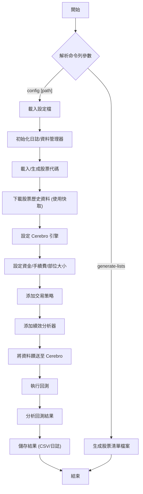

# Backtrader 量化交易回測系統

一個基於 Backtrader 框架的完整台股量化交易回測系統，實作 Breakout20 策略。

## 系統架構

```
BacktestKit/
├── configs/                # 設定檔目錄
│   └── default.yml         # 預設設定檔
├── data/                   # 資料目錄
│   ├── cache/              # 資料快取
│   ├── stock_lists/        # 股票清單
│   │   └── generator.py    # 股票清單生成器
│   └── utils/
│       └── data_manager.py # 資料下載管理器
├── strategies/             # 策略目錄
│   └── breakout20.py       # Breakout20 策略
├── analyzers/              # 分析器目錄
│   └── custom_metrics.py   # 自訂績效分析器
├── utils/                  # 工具目錄
│   ├── config_loader.py    # 設定檔載入器
│   └── logger.py           # 日誌工具
├── results/                # 結果輸出目錄
│   ├── csv/                # CSV 結果檔案
│   ├── logs/               # 日誌檔案
│   └── reports/            # 報告檔案
├── requirements.txt        # 依賴套件
└── main.py                 # 主程式
```

## 系統流程圖



## 安裝依賴

```bash
pip install -r requirements.txt
```

## 使用方法

### 1. 生成股票清單檔案

```bash
python main.py --generate-lists
```

這會生成：
- `data/stock_lists/0050_list.csv` - 台灣50成分股
- `data/stock_lists/mid100_list.csv` - 中型100成分股

### 2. 執行回測

```bash
python main.py
```

或使用自訂設定檔：

```bash
python main.py --config configs/custom.yml
```

## Breakout20 策略說明

### 策略邏輯

1. **追蹤啟動**：收盤價跌破20日SMA時設定 tracking=True
2. **進場條件**：tracking=True 且收盤價突破過去20日最高價
3. **停損條件**：日內最低價跌破進場時最低價，以收盤價出場
4. **重啟條件**：平倉後重設 tracking=False

### 技術指標

- **SMA（Simple Moving Average）**：20日簡單移動平均線
- **Highest**：20日最高價

## 設定檔說明

`configs/default.yml` 包含所有回測參數：

```yaml
# 回測時間範圍
start_date: '2020-06-21'
end_date: '2025-06-20'

# 股票清單檔案
symbol_files:
  - 'data/stock_lists/0050_list.csv'
  - 'data/stock_lists/mid100_list.csv'

# 策略設定
strategy:
  name: 'Breakout20'
  params:
    sma_window: 20
    high_window: 20

# 資金設定
cash: 10_000_000        # 初始資金 (1000萬台幣)
commission: 0.001425    # 手續費率 (0.1425%)
slippage: 0.001         # 滑價 (0.1%)

# 部位大小設定
sizer:
  type: 'PercentSizer'
  percents: 2           # 每筆交易使用2%資金
```

## 輸出結果

### 1. 終端機顯示

- 回測進度
- 績效摘要報告
- 關鍵統計指標

### 2. CSV 檔案

- `results/csv/backtest_results.csv` - 詳細交易記錄
- `results/csv/backtest_results_summary.csv` - 績效摘要

### 3. 日誌檔案

- `results/logs/backtest.log` - 完整執行日誌

## 績效指標

系統提供完整的績效分析，包括：

- **報酬指標**
  - 總報酬率 (Total Return)
  - 年化複合報酬率 (CAGR)
  - 夏普比率 (Sharpe Ratio)
  - 年化波動率 (Volatility)

- **風險指標**
  - 最大回撤 (Maximum Drawdown)
  - 最大回撤期間 (Max Drawdown Duration)

- **交易統計**
  - 總交易次數
  - 勝率 (Win Rate)
  - 獲利因子 (Profit Factor)
  - 平均獲利/虧損交易

## 功能特色

- **模組化設計**：易於擴充和維護
- **快取機制**：使用 joblib 避免重複下載資料
- **完整日誌**：使用 loguru 提供結構化日誌
- **設定驅動**：透過 YAML 設定檔靈活配置
- **詳細分析**：提供豐富的績效指標和交易明細
- **錯誤處理**：完善的例外處理和資料驗證

## 擴充說明

### 添加新策略

1. 在 `strategies/` 目錄建立新的策略檔案
2. 繼承 `bt.Strategy` 類別
3. 在 `main.py` 中註冊新策略

### 添加新指標

1. 在 `analyzers/` 目錄建立新的分析器
2. 繼承 `bt.Analyzer` 類別
3. 在回測流程中添加分析器

### 自訂資料來源

1. 在 `data/utils/` 目錄擴充資料管理器
2. 實作新的資料下載介面
3. 更新設定檔格式

## 注意事項

- 台股代碼會自動加上 `.TW` 後綴
- 系統預設使用千股為最小交易單位
- 快取檔案存放在 `data/cache/` 目錄
- 首次執行會自動下載所有股票資料
- 建議在充足網路環境下執行資料下載

## 授權

本專案採用 MIT 授權條款。
