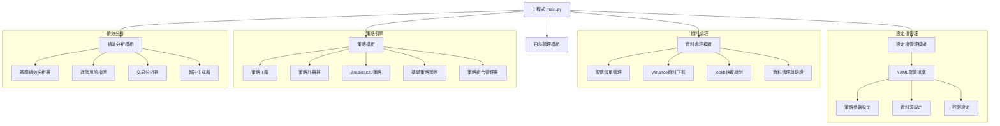
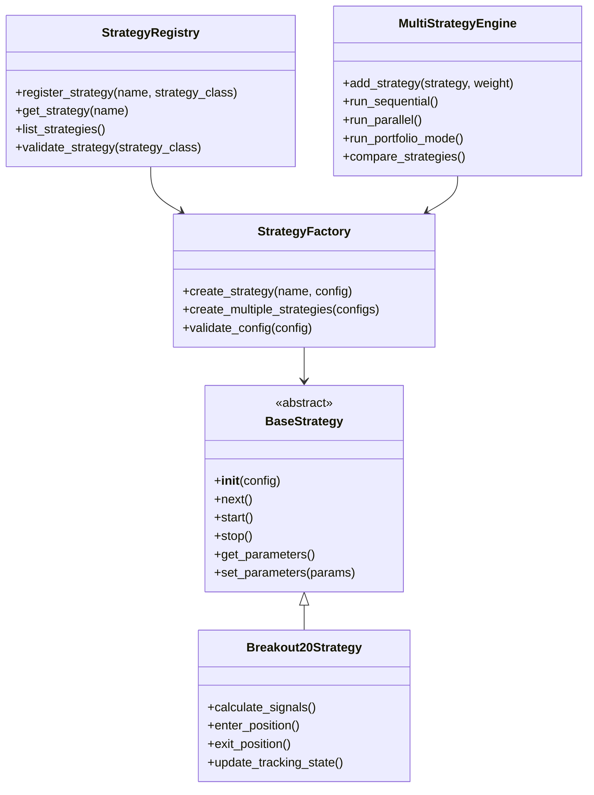
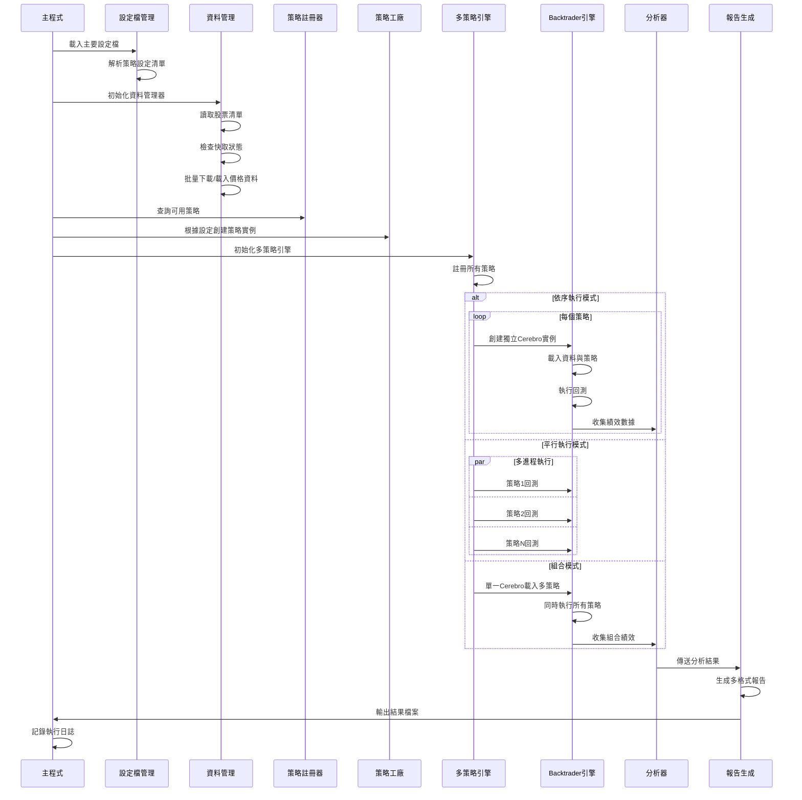

# Backtrader 量化交易回測系統架構設計

## 專案概述

### 系統目標
設計一套使用 Backtrader 的量化交易回測系統，主要針對台灣股市進行多策略回測分析。

### 交易標的
- 元大台灣50 ETF (0050.TW)
- 台灣中型100指數成分股

### 資料期間
2020-06-21 至 2025-06-20 (5年期間)

### 初始策略
Breakout20 策略：收盤價跌破SMA20啟動追蹤，突破20日高點進場，跌破進場低點停損

### 資金管理
每次進場固定買入1張股票（簡化版本，未來可擴展為2%資金管理）

---

## 整體系統架構



---

## 詳細目錄結構

```
BacktestKit/
├── configs/
│   ├── __init__.py
│   ├── config_manager.py          # 設定檔管理類別
│   ├── backtest_config.yaml       # 主要設定檔
│   └── strategies/                # 策略專用設定檔目錄
│       ├── breakout20_config.yaml
│       └── strategy_template.yaml
├── data/
│   ├── __init__.py
│   ├── data_manager.py            # 資料管理主類別
│   ├── stock_list_manager.py      # 股票清單管理
│   ├── price_downloader.py        # 價格資料下載器
│   ├── cache/                     # 快取資料目錄
│   │   ├── prices/                # 股價快取
│   │   └── metadata/              # 元資料快取
│   ├── stock_lists/
│   │   ├── 0050_list.csv
│   │   └── mid100_list.csv
│   └── utils/
│       ├── __init__.py
│       └── data_validator.py      # 資料驗證工具
├── strategies/
│   ├── __init__.py
│   ├── strategy_factory.py        # 策略工廠類別
│   ├── strategy_registry.py       # 策略註冊器
│   ├── base_strategy.py           # 基礎策略抽象類別
│   ├── breakout20_strategy.py     # Breakout20策略實作
│   ├── multi_strategy_engine.py   # 多策略執行引擎
│   └── utils/
│       ├── __init__.py
│       ├── indicators.py          # 自訂技術指標
│       ├── signal_generator.py    # 信號生成器
│       └── position_sizer.py      # 倉位管理器
├── analyzers/
│   ├── __init__.py
│   ├── performance_analyzer.py    # 績效分析器基類
│   ├── basic_metrics.py          # 基礎績效指標
│   ├── risk_metrics.py           # 風險指標分析器
│   ├── trade_analyzer.py         # 交易分析器
│   ├── strategy_comparison.py    # 策略比較分析器
│   └── report_generator.py       # 報告生成器
├── utils/
│   ├── __init__.py
│   ├── logger.py                 # 日誌管理
│   ├── helpers.py                # 輔助函數
│   └── decorators.py             # 裝飾器工具
├── results/                      # 結果輸出目錄
│   ├── reports/                  # HTML/PDF報告
│   │   ├── single_strategy/      # 單策略報告
│   │   └── multi_strategy/       # 多策略比較報告
│   ├── csv/                      # CSV交易紀錄
│   └── logs/                     # 日誌檔案
├── tests/                        # 單元測試
│   ├── __init__.py
│   ├── test_strategies/
│   ├── test_data/
│   └── test_analyzers/
├── main.py                       # 主程式入口
├── requirements.txt              # 依賴套件
└── README.md                     # 專案說明
```

---

## 核心模組詳細設計

### 1. 設定檔管理模組 (configs/)

#### 主要設定檔結構 (backtest_config.yaml)
```yaml
# 回測基本設定
backtest:
  start_date: "2020-06-21"
  end_date: "2025-06-20"
  initial_cash: 1000000
  commission: 0.001425  # 台股手續費
  slippage: 0.001       # 滑價設定

# 資料來源設定
data:
  cache_enabled: true
  cache_expiry_days: 7
  data_source: "yfinance"
  stock_lists:
    - "data/stock_lists/0050_list.csv"
    - "data/stock_lists/mid100_list.csv"
  data_validation:
    min_trading_days: 252  # 最少交易天數
    max_missing_ratio: 0.05  # 最大缺失比例

# 多策略管理設定
strategies:
  execution_mode: "sequential"  # sequential | parallel | portfolio
  strategy_configs:
    - name: "Breakout20"
      config_file: "strategies/breakout20_config.yaml"
      enabled: true
      weight: 1.0  # 組合權重（未來使用）
  
# 績效分析設定
performance:
  basic_metrics: true
  risk_metrics: true
  trade_analysis: true
  detailed_reports: true
  benchmark: "0050.TW"  # 基準指標

# 日誌設定
logging:
  level: "INFO"
  file_rotation: true
  max_file_size: "10MB"
  retention_days: 30
```

#### 策略專用設定檔 (strategies/breakout20_config.yaml)
```yaml
strategy:
  name: "Breakout20"
  description: "20日突破策略"
  version: "1.0.0"
  
parameters:
  sma_period: 20
  breakout_period: 20
  position_size: 1000  # 固定1張
  
# 未來擴展：個股參數設定
individual_params:
  enabled: false  # 預留個別參數接口
  param_file: "individual_stock_params.csv"
  
# 策略風險控制
risk_management:
  max_positions: 10  # 最大同時持倉數
  stop_loss_pct: 0.05  # 停損百分比（備用）
  
# 策略評估設定
evaluation:
  benchmark_comparison: true
  rolling_performance: true
  rolling_window_days: 252
```

### 2. 資料處理模組 (data/)

#### 核心類別設計

**DataManager 類別**
```python
class DataManager:
    """統一資料管理接口"""
    
    def __init__(self, config: dict):
        """初始化資料管理器"""
        
    def get_stock_data(self, symbols: List[str], 
                      start_date: str, end_date: str) -> Dict[str, pd.DataFrame]:
        """獲取股票資料（含快取機制）"""
        
    def validate_data(self, data: Dict[str, pd.DataFrame]) -> Dict[str, pd.DataFrame]:
        """資料驗證與清理"""
        
    def get_cache_status(self) -> Dict[str, dict]:
        """查詢快取狀態"""
```

**PriceDownloader 類別**
```python
class PriceDownloader:
    """價格資料下載器（含智慧快取）"""
    
    def __init__(self, cache_dir: str, cache_expiry_days: int = 7):
        """初始化下載器與快取設定"""
        
    @cached_method  # joblib.Memory 裝飾器
    def download_price_data(self, symbol: str, start_date: str, 
                          end_date: str) -> pd.DataFrame:
        """下載單一股票價格資料"""
        
    def batch_download(self, symbols: List[str], start_date: str, 
                      end_date: str, max_workers: int = 5) -> Dict[str, pd.DataFrame]:
        """批量下載（多線程優化）"""
```

#### 快取機制設計
- 使用 `joblib.Memory` 實作持久化快取
- 按股票代碼分別快取，支援增量更新
- 快取檔案結構：`cache/prices/{symbol}_{start_date}_{end_date}.pkl`
- 自動檢測快取過期，智慧更新策略

### 3. 策略模組擴展性設計 (strategies/)

#### 策略框架架構



#### 策略註冊機制
```python
class StrategyRegistry:
    """策略註冊器 - 支援動態策略載入"""
    
    _strategies = {}
    
    @classmethod
    def register(cls, name: str, strategy_class: type):
        """註冊新策略"""
        cls._strategies[name] = strategy_class
    
    @classmethod
    def get_strategy(cls, name: str) -> type:
        """取得策略類別"""
        return cls._strategies.get(name)
    
    @classmethod
    def list_strategies(cls) -> List[str]:
        """列出所有可用策略"""
        return list(cls._strategies.keys())

# 使用裝飾器自動註冊策略
@StrategyRegistry.register("Breakout20")
class Breakout20Strategy(BaseStrategy):
    """Breakout20策略實作"""
```

#### 多策略執行引擎
```python
class MultiStrategyEngine:
    """多策略執行引擎"""
    
    def __init__(self, config: dict):
        self.strategies = []
        self.execution_mode = config.get('execution_mode', 'sequential')
        
    def add_strategy(self, strategy_name: str, strategy_config: dict, weight: float = 1.0):
        """新增策略到執行清單"""
        
    def run_sequential(self) -> Dict[str, Any]:
        """依序執行所有策略"""
        
    def run_parallel(self) -> Dict[str, Any]:
        """平行執行所有策略（多進程）"""
        
    def run_portfolio_mode(self) -> Dict[str, Any]:
        """組合模式：多策略同時運作"""
        
    def compare_strategies(self) -> pd.DataFrame:
        """策略績效比較分析"""
```

#### 策略擴展接口設計
```python
class BaseStrategy(bt.Strategy):
    """基礎策略抽象類別 - 定義統一接口"""
    
    # 策略元資料
    strategy_name = "BaseStrategy"
    strategy_version = "1.0.0"
    required_indicators = []
    
    def __init__(self):
        super().__init__()
        self.config = self.get_strategy_config()
        self.params = self.get_default_params()
        
    @abstractmethod
    def calculate_signals(self) -> Dict[str, Any]:
        """計算交易信號 - 子類必須實作"""
        pass
        
    @abstractmethod
    def enter_position(self, data, signal: dict):
        """進場邏輯 - 子類必須實作"""
        pass
        
    @abstractmethod
    def exit_position(self, data, signal: dict):
        """出場邏輯 - 子類必須實作"""
        pass
        
    def get_strategy_config(self) -> dict:
        """取得策略設定"""
        return {}
        
    def get_default_params(self) -> dict:
        """取得預設參數"""
        return {}
        
    def validate_params(self, params: dict) -> bool:
        """參數驗證"""
        return True
        
    # 預留未來擴展方法
    def optimize_parameters(self, data: pd.DataFrame) -> dict:
        """參數優化接口"""
        pass
        
    def risk_check(self) -> bool:
        """風險檢查接口"""
        return True
```

### 4. 績效分析模組 (analyzers/)

#### 分析器分層架構
```python
class PerformanceAnalyzer(bt.Analyzer):
    """績效分析器基礎類別"""
    
    def __init__(self):
        self.metrics = {}
        self.trades = []
        
    def start(self):
        """回測開始時初始化"""
        
    def next(self):
        """每個交易日更新"""
        
    def stop(self):
        """回測結束時計算最終指標"""
```

#### 完整績效指標設計

**基礎指標 (BasicMetrics)**
- 總報酬率、年化報酬率
- 勝率、平均獲利/虧損比
- 最大回撤、最大連續虧損
- 交易次數、平均持倉天數

**風險指標 (RiskMetrics)**
- Sharpe Ratio、Sortino Ratio、Calmar Ratio
- VaR (95%, 99%)、CVaR (條件風險值)
- Beta值、相關係數
- 下行波動率、上行捕獲率

**交易分析 (TradeAnalyzer)**
- 持倉天數分布直方圖
- 月度/季度績效熱力圖
- 個股貢獻度排名
- 進出場時機分析

**策略比較分析 (StrategyComparison)**
- 多策略績效對比表
- 風險調整後報酬比較
- 相關性矩陣分析
- 組合最佳化建議

### 5. 系統資料流程



---

## 關鍵技術實作方案

### 1. 智慧快取機制
```python
from joblib import Memory
import os
from datetime import datetime, timedelta

class SmartCache:
    """智慧快取管理器"""
    
    def __init__(self, cache_dir: str, expiry_days: int = 7):
        self.memory = Memory(cache_dir, verbose=0)
        self.expiry_days = expiry_days
        
    def is_cache_valid(self, cache_file: str) -> bool:
        """檢查快取是否有效"""
        if not os.path.exists(cache_file):
            return False
            
        file_time = datetime.fromtimestamp(os.path.getmtime(cache_file))
        return datetime.now() - file_time < timedelta(days=self.expiry_days)
        
    @property
    def cached_download(self):
        """快取裝飾器"""
        return self.memory.cache(self._download_data)
        
    def _download_data(self, symbol: str, start_date: str, end_date: str):
        """實際下載邏輯"""
        # yfinance 下載實作
        pass
```

### 2. 日誌系統設計
```python
import logging
from logging.handlers import RotatingFileHandler
from datetime import datetime

class BacktestLogger:
    """回測專用日誌系統"""
    
    def __init__(self, config: dict):
        self.setup_loggers(config)
        
    def setup_loggers(self, config: dict):
        """設置多層級日誌"""
        
        # 主要日誌
        self.main_logger = self._create_logger(
            'backtest_main', 
            'logs/backtest_main.log',
            config['level']
        )
        
        # 交易日誌
        self.trade_logger = self._create_logger(
            'backtest_trades',
            'logs/trades.log', 
            'INFO'
        )
        
        # 錯誤日誌
        self.error_logger = self._create_logger(
            'backtest_errors',
            'logs/errors.log',
            'ERROR'
        )
        
    def _create_logger(self, name: str, file_path: str, level: str):
        """創建指定層級的日誌器"""
        logger = logging.getLogger(name)
        logger.setLevel(getattr(logging, level))
        
        # 輪轉檔案處理器
        handler = RotatingFileHandler(
            file_path, 
            maxBytes=10*1024*1024,  # 10MB
            backupCount=5
        )
        
        formatter = logging.Formatter(
            '%(asctime)s - %(name)s - %(levelname)s - %(message)s'
        )
        handler.setFormatter(formatter)
        logger.addHandler(handler)
        
        return logger
```

### 3. 策略參數優化接口
```python
class ParameterOptimizer:
    """策略參數優化器（未來擴展）"""
    
    def __init__(self, strategy_class: type):
        self.strategy_class = strategy_class
        
    def grid_search(self, param_grid: dict, data: pd.DataFrame) -> dict:
        """網格搜索優化"""
        pass
        
    def genetic_algorithm(self, param_bounds: dict, data: pd.DataFrame) -> dict:
        """遺傳演算法優化"""
        pass
        
    def bayesian_optimization(self, param_space: dict, data: pd.DataFrame) -> dict:
        """貝氏優化"""
        pass
```

---

## 開發實施計畫

### 階段一：基礎框架建置 (2-3週)
**Week 1-2: 核心基礎設施**
1. 專案結構建立
2. 設定檔管理模組 (`configs/`)
3. 日誌系統實作 (`utils/logger.py`)
4. 資料下載與快取機制 (`data/`)
5. 基本單元測試框架

**Week 3: 策略框架**
6. 基礎策略抽象類別 (`strategies/base_strategy.py`)
7. 策略註冊機制 (`strategies/strategy_registry.py`)
8. 策略工廠模式 (`strategies/strategy_factory.py`)

### 階段二：策略實作與回測引擎 (2週)
**Week 4: Breakout20策略**
9. Breakout20策略開發
10. 策略設定檔整合
11. 單策略回測測試

**Week 5: 多策略引擎**
12. 多策略執行引擎實作
13. 策略比較功能
14. 並行執行優化

### 階段三：績效分析系統 (2-3週)
**Week 6-7: 分析器開發**
15. 基礎績效指標分析器
16. 進階風險指標分析器
17. 交易分析器
18. 策略比較分析器

**Week 8: 報告系統**
19. 報告生成器實作
20. 多格式輸出 (CSV, HTML, PDF)
21. 圖表可視化整合

### 階段四：系統優化與文檔 (1週)
**Week 9: 系統完善**
22. 錯誤處理機制強化
23. 效能測試與優化
24. 完整單元測試
25. 使用文檔撰寫
26. 部署指南準備

---

## 未來擴展規劃

### 短期擴展 (3-6個月)
1. **更多策略支援**
   - 移動平均交叉策略
   - RSI背離策略
   - 布林通道策略
   
2. **參數優化功能**
   - 網格搜索
   - 遺傳演算法
   - 貝氏優化

3. **更多資料源**
   - TEJ台灣經濟新報
   - Yahoo Finance API v2
   - 即時資料串流

### 中期擴展 (6-12個月)
1. **機器學習整合**
   - 特徵工程模組
   - ML策略框架
   - 模型評估工具

2. **風險管理系統**
   - 動態倉位管理
   - 組合風險控制
   - 即時風險監控

3. **Web介面開發**
   - 策略管理介面
   - 即時監控面板
   - 績效報告查看

### 長期願景 (1年以上)
1. **雲端部署架構**
   - Docker容器化
   - Kubernetes編排
   - 微服務架構

2. **即時交易系統**
   - 券商API整合
   - 自動交易執行
   - 風險控制機制

---

## 總結

本架構設計以模組化、可擴展性為核心原則，特別強化了策略模組的擴展能力：

### 核心優勢
1. **高度模組化**：各模組職責清晰，低耦合高內聚
2. **策略擴展性**：支援多策略註冊、並行執行、組合運作
3. **完整分析體系**：從基礎指標到進階風險分析全覆蓋
4. **智慧快取機制**：提升資料處理效率
5. **專業日誌系統**：支援問題追蹤與系統監控

### 技術特色
- 工廠模式 + 註冊機制實現策略動態載入
- 抽象基類確保策略接口一致性
- 多執行模式支援不同回測需求
- joblib智慧快取優化資料處理效能
- 完整的物件導向設計

### 擴展能力
- 新策略只需繼承基類並註冊即可
- 支援策略參數個別化設定
- 預留機器學習策略接口
- 可無縫升級為即時交易系統

此架構為一個具備生產級品質的量化交易回測系統奠定了堅實基礎，既滿足當前需求，又為未來發展預留充分空間。